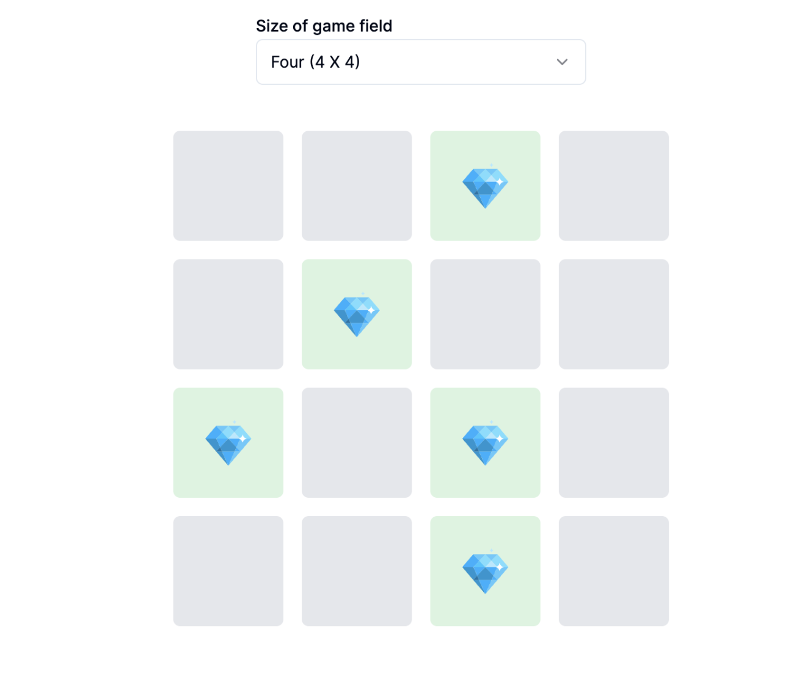

# Mine game [`Mine game`](https://mine-diamond.vercel.app/) project bootstrapped with [`create-next-app`](https://github.com/vercel/next.js/tree/canary/packages/create-next-app)

This is a simple mine game project. You can play the game by clicking on the cells. If you click on a mine, you will lose the game. If you click on a cell that has no mine, you will see a gem. Your job is to find all the gems without clicking on any mine.



## Getting Started

First, pull the project from the repository:

```bash
git clone https://github.com/mahmudulnayeem/mine-game.git
```

Then, navigate to the project directory:

```bash
cd mine-game
```

Install the dependencies:

```bash
bun install
```

Then, run the development server:

```bash
bun dev
```

Open [http://localhost:3000](http://localhost:3000) with your browser to see the result.

You can start editing the page by modifying `app/page.tsx`. The page auto-updates as you edit the file.

## Learn More

To learn more about Next.js, take a look at the following resources:

- [Next.js Documentation](https://nextjs.org/docs) - learn about Next.js features and API.
- [Learn Next.js](https://nextjs.org/learn) - an interactive Next.js tutorial.

You can check out [the Next.js GitHub repository](https://github.com/vercel/next.js/) - your feedback and contributions are welcome!

## Deploy on Vercel

The easiest way to deploy your Next.js app is to use the [Vercel Platform](https://vercel.com/new?utm_medium=default-template&filter=next.js&utm_source=create-next-app&utm_campaign=create-next-app-readme) from the creators of Next.js.
